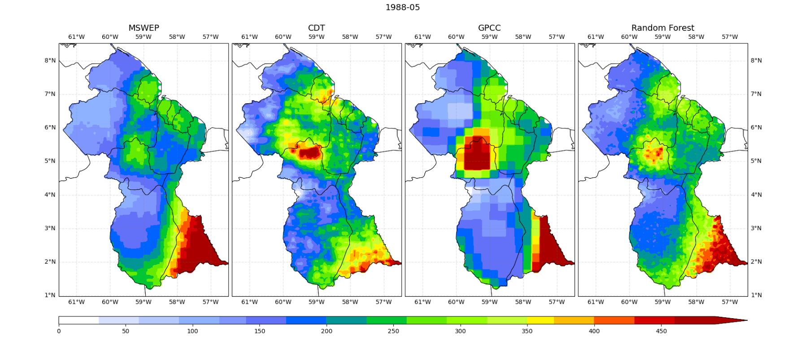

# RF_Precipitation_Grid

A Random Forest is a very popular machine learning technique. Random Forests have a very high generalizability for many problems.
The purpose of this project is to create a precipitation grid, from different combinations of inputs, using random forest regression as an algorithm. The ERA5, MSWEP, CHIRP, GPCC, GPM and CDT models are used in the preparation of the combinations, they are evaluated and the ones with the best score are selected.

**Source Data:**

ERA5: https://cds.climate.copernicus.eu/cdsapp#!/dataset/reanalysis-era5-single-levels-monthly-means?tab=overview

MSWEP: http://www.gloh2o.org 

CHIRP: https://data.chc.ucsb.edu/products/CHIRPS-2.0/

GPCC: https://rda.ucar.edu/datasets/ds496.0/ 

GPM: https://gpm1.gesdisc.eosdis.nasa.gov/data/GPM_L3/ 

<!-- CDT: The monthly data set created with CDT (https://github.com/rijaf-iri/CDT) was created 
from CHIRPS (https://data.chc.ucsb.edu/products/CHIRPS-2.0/) and series of precipitation 
data measured in meteorological stations

CDT dataset (https://github.com/rijaf-iri/CDT) was created from CHIRPS (https://data.chc.ucsb.edu/products/CHIRPS-2.0/) and 
datasets of precipitation measured in meteorological stations
 -->

CDT: The monthly data set created with CDT (https://github.com/rijaf-iri/CDT) using CHIRPS (https://data.chc.ucsb.edu/products/CHIRPS-2.0/) and 
series of precipitation  data measured in meteorological stations. 

**The project is structured as follows:**

Read from the raw data, interpolate, using nearest neighbor, and use these interpolations as input to the random forest model. Once training, the results are evaluated and the best combination is selected. For each training the results are saved in netcdf format; In addition, the training models are saved for later use in new predictions.

**Random Forest grid generation:**

1) Read the netcdf of the data and extract values against dates. 
These values, for each model, are saved in “name_model.mat” (with the original resolution), 
being name_model, the corresponding entry (ERA5, MSWEP, GPCC, etc.). See script _01_script.py_.

2) The “name_model.mat” data obtained in the previous step is interpolated, 
using the Nearest Neighbor method, at 5 km resolution, leaving the new 
“name_model_interp_nearest.mat” files. See script _03_script.py_.

3) Once the input models (X1, X2, …, Xn) have been interpolated, the _eval.py_ script is executed, 
in which the possible combinations for RF training are generated. 
Once trained, each RF model is saved in the “models/” directory, with the name “model_X1_X2_Y_rf_trained.pkl”, 
being X1,X2,Y the two predictor models and the paradigm, respectively. Additionally, the metrics obtained during 
the training are saved in text format, as well as the annual march, and optionally, the visual output of the resulting maps. 
The results of each combination are saved in netCDF format (“X1_X2_Y_RF.nc”).

The following example is for May 1988, and was generated with the MSWEP and CDT models as X1 and X2, the GPCC model as Y, and the corresponding Random Forest output

en el fichero  se observa otra cosa

